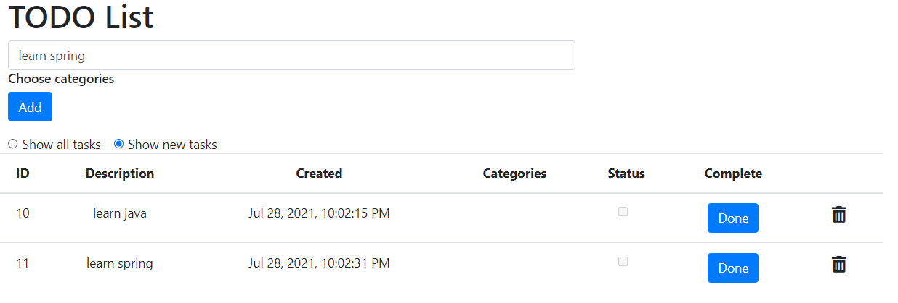
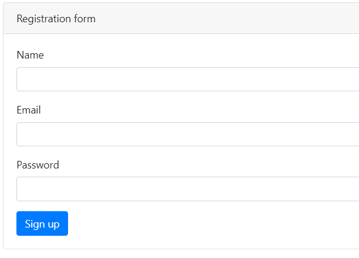
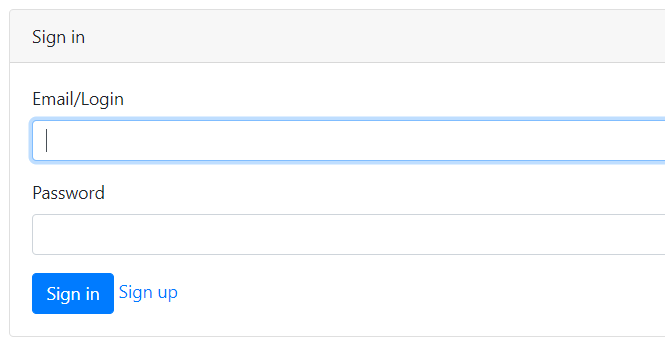

# TODO list
Это приложение - список дел. Позволяет пользователям вести список заданий. Задания сохраняются в БД. Клиент с контроллером обмениваются сообщениями в формате JSON.

### Технологии
* Java 15
* Java EE Servlets
* PostgreSQL, Hibernate, Liquibase
* JUnit, Mockito, PowerMock
* JS, AJAX, HTML5, Bootstrap (front)
* Gson, json-simple for parsing JSONs
* Maven
* Tomcat
* Travis CI

### Возможности
* Авторизация/регистрация.
* Добавление заданий в список.
* Удаление заданий из списка.
* Отметка о завершении задания.
* Фильтр для отображения в списке только новых (невыполненных) заданий.

---
* Главная страница

* Регистрация

* Авторизация

